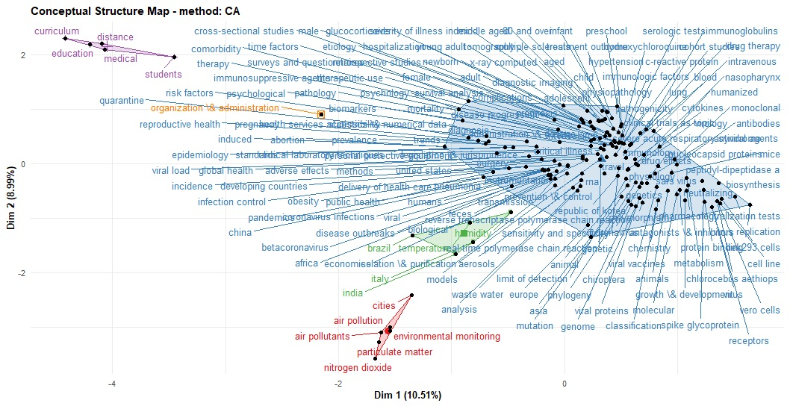

<head>
  <script async src="https://pagead2.googlesyndication.com/pagead/js/adsbygoogle.js?client=ca-pub-4447780400240825" crossorigin="anonymous"></script>
</head>

# Plan of attack
## Source of data 
- Let's do a quick PubMed search. Copy the following search terms and search on PubMed.
Search terms: (covid 19) AND (("2020/08/02"[Date - Publication] : "3000"[Date - Publication]))

- Alternatively you can find the search link [here](https://pubmed.ncbi.nlm.nih.gov/?term=%28covid+19%29+AND+%28%28%222020%2F07%2F31%22%5BDate+-+Publication%5D+%3A+%223000%22%5BDate+-+Publication%5D%29%29).
- With the above search terms, we can retrieve 601 COVID-19 related records that were indexed in PubMed on August 03, 2020.

- We can now open these records using our citation manager: EndNote, Mendeley, etc. 
- Since the file is in RIS format, we must convert it to BibTeX so that we can benefit from **Bibliomterix** package. 
- I will come back in the future in another blog post to show you on how to convert RIS file to BibTeX or converting from CSV/XSL reference file to EndNote-readable format. For today, let's just use the converted [COVID19 BibTeX file](https://github.com/Mihiretukebede/mihiretukebede.gitlub.io/blob/master/posts/2020-08-03-2020-08-03-covid19/covid19.bib). We can load convert our BibTeX file using either *bibliometrix* and then *bib2df* package. 

Let's first use *bibliometrix* and then *bib2df* package to convert our [COVID19 BibTeX file](https://github.com/Mihiretukebede/mihiretukebede.gitlub.io/blob/master/posts/2020-08-03-2020-08-03-covid19/covid19.bib) to data frame. 

## Initialize
Set working directory

## Load necessary packages

```{r, cache=T, include=T, echo=T, message=FALSE, warning=FALSE}
library(bibliometrix) #for bibliometric analysis
library(dplyr) #for data management
library(ggplot2) #for plotting
library(tidytext) #for text mining
library(bib2df) #for converting bib file to data frame
library(wordcloud) #for plotting most frequent words
```

# Import the data to R: Covert the BibTeX file to data frame 

```{r, cache=T, error=FALSE, include=T, echo=T, message=FALSE, warning=FALSE}
covid19_bibanalysis <- convert2df("covid19.bib", dbsource = "isi", format = "bibtex")

#As usual, isnpect the data
dim(covid19_bibanalysis) #601 records, 23 variables
glimpse(covid19_bibanalysis) #Inspect the structure of data, variable names, etc
```

# Now bibliometrics analysis

```{r, cache=T, include=T, echo=T, message=FALSE, warning=FALSE}
results <-  biblioAnalysis(covid19_bibanalysis, sep = ",") #create the object
options(width=100) #to determine width of the plot

s <- summary(object=results, k=10, pase=FALSE) #to present 10 most prominent authors, journals, keywords, etc

plot(x=results, k=10, pause=FALSE) #plot the results

#since all of them are indexed in August 2020, this may not be useful analysis. 

# Let's see sankey plots. But, before that we must remove missing values
threeFieldsPlot(covid19_bibanalysis, fields = c("AU", "DE", "SO"))

```

Look at this plot. It maps Authors with keywords and with the journals. With 61 articles indexed in PubMed in one day, a journal called, EMERGING MICROBES \\& INFECTIONS  is leading the league. 

```{r, cache=T, include=T, echo=T, message=FALSE, warning=FALSE}


## Now let's do some clustering
# Let's just use key words
cs <- conceptualStructure(covid19_bibanalysis, field="DE", 
                          method="CA", minDegree = 4,
                          stemming=FALSE, labelsize = 10, documents=2) 

# Let's now use Akey words
# is abit dense to vizualize it here. It is very dense. 
csAB <- conceptualStructure(covid19_bibanalysis, field="DE", 
                          method="CA", minDegree = 4,
                          stemming=FALSE, labelsize = 10, documents=2)
```

```{r out.width="100%"}

```

The figure above shows keywords of the articles are clustered into five main categories.

 1. Clinical, molecular and epidemiological keywords: the biggest part of the  cluster with blue text on the figure
 2. Environmental monitoring cluster
 3. Humidity studies cluster
 4. Medical education cluster
 5. Organization and administration cluster
 

# Now, let's use bib2df 

It is also possible to continue our analysis using the `covid19_bibanalysis`data. However, it is good to try another package, `bib2df`. We will use this package to convert our BibTeX file to data frame and then from there we can perform text mining. It is also good to note that the data frame converted using *bibliometrix*  package may not also work properly with *dplyr*. But, that depends with your *rlang*. I have experienced some errors using *bibliometrix* package with *dplyr*.  

```{r, cache=T, include=T, echo=T, message=FALSE, warning=FALSE}
library(bib2df)
covid19 <- bib2df("covid19.bib")
```

# Inspect the data

```{r, cache=T, include=T, echo=T, message=FALSE, warning=FALSE}
glimpse(covid19) 
#Let's choose only some of our variabees

covid19data <- covid19 %>% 
  select("AUTHOR", "TITLE", "KEYWORDS", "ABSTRACT", "JOURNAL","DOI")

dim(covid19) #601 records, 23 variables
which(!complete.cases(covid19$DOI)) # All of them have missing values
sum(is.na(covid19$ABSTRACT)) #159 studies have no abstract
sum(is.na(covid19$TITLE)) # 0 records have missing values
sum(is.na(covid19$DOI)) #2 studies have no doi
sum(!is.na(covid19$ABSTRACT)) #442 records have abstracts
table(covid19$CATEGORY) #452 are journal aricles, 149 are Miscelaneous(books, conference abstracst, etc. 
```

# Let's filter out the records with no Abstract

```{r, cache=T, include=T, echo=T, message=FALSE, warning=FALSE}
#Let's filter the data to retreive only the records with Abstract
#As we have seen above, we have 159 records without abstracts
#use dplyr to filter
library(dplyr)
covid19new <- covid19 %>%
  filter(!is.na(ABSTRACT)) #remove all records with missing abstracts
sum(!is.na(covid19new$ABSTRACT)) #442 records have abstracts
   #BINGO! We excluded the studies without Abstract. Now we, can play with text mining. 

```
# I am interested only in Journal articles 
We need to find out the type of these records: journal articles, books, conference abstracts, etc. We can then focus on journal articles having with abstracts included in PubMed. 

```{r, cache=T, include=T, echo=T, message=FALSE, warning=FALSE}
table(covid19new$CATEGORY) #382 are journal articles, 60 are Miscelaneous documents

# Filter journal articles having  abstracts 
covid19new <- covid19new %>% 
  filter(CATEGORY=="ARTICLE") 
#Check 
table(covid19new$CATEGORY) #382 journal articles
```

# Text mining

- Since we already have our 442 studies with no missing abstract, we can conduct our text mining analysis using this data frame.  
- There are several r packages for conducting text mining. Most popular packages are *tidytext*, *text2vec*, *quanteda*, *tm* and *stringr*. 
- For today, I will simply follow  *tidytext*.
- There are some important steps in text mining such as tokenization, visualization, computing tf-idf statistics, n-grams, etc
- Term frequency inverse document frequency (tf-idf) is a weighted numerical representation of how a certain word is important in a document. It is calculated using the following formula. 

$$tfidf( t, d, D ) = tf( t, d ) \times idf( t, D )$$
$$idf( t, D ) = log \frac{ \text{| } D \text{ |} }{ 1 + \text{| } \{ d \in D : t \in d \} \text{ |} }$$

Where `t` is the terms appearing in a document; `d` denotes each document; `D` denotes the collection of documents.

```{r, cache=T, include=T, echo=T, message=FALSE, warning=FALSE}
# selct few variables from our data set
data <- covid19new %>% 
  select("TITLE", "ABSTRACT", "KEYWORDS", "AUTHOR")

```
# Tokenization

- Tokenization is the process of breaking a certain text into word by word columns. For example, if one abstract is written using 300 words, tokenizing the abstract will result in 300 columns for each word. This will make things easy to count words and do any further analysis.    
```{r, cache=T, include=T, echo=T, message=FALSE, warning=FALSE}
tidy_covid_data <- data %>% 
  unnest_tokens(input=ABSTRACT, output=word)
```
# Remove stop words
Stop words are words that are not very relevant to the meaning or concept of the document. For example, see this sentence. "The COVID19 pandemic is the biggest global health crisis of our time". In this sentence,  "the, is, of, our" are not relevant for the concept of this text. These words need to be removed from our analysis. To remove these words, we can use the stopwords data which is available for us. If we want to add additional stop words we can customize and create our own customized stop words. 

```{r, cache=T, include=T, echo=T, message=FALSE, warning=FALSE}
data("stop_words")
tidy_covid_data <- tidy_covid_data %>% 
  anti_join(stop_words)
```

# Customize stop_words

- Usually, abstract contains words like "background", "introduction", "materials", "methods", "results", "conclusions", etc. Let's remove these words 

```{r, cache=T, include=T, echo=T, message=FALSE, warning=FALSE}
# since it is all about covid-19, we don't need covid 
custom_stop_words <- bind_rows(tibble(word=c("covid", "cov", "background", "introduction", "materials", "methods", "results", "conclusions", "0", "1","2", "3", "4", "5", "6", "7", "8", "9","19", "2019", "2020", "95"),
                                      lexicon = c("custom")),
                               stop_words)

tidy_covid_data <- tidy_covid_data %>% 
  anti_join(custom_stop_words)
# count number of words and plot it
 tidy_covid_data %>% 
  count(word, sort=T) %>% 
   filter(n>100) %>% 
   mutate(word=reorder(word, n)) %>% 
   ggplot(aes(x=word, y=n)) + 
   geom_col(fill="#619CFF") + coord_flip()
```

 
# Word cloud

```{r out.width="80%", cache=T, include=T, echo=T, message=FALSE, warning=FALSE}
library(wordcloud)
pal <- brewer.pal(8, "Dark2")
tidy_covid_data %>% 
  count(word) %>% 
  with(wordcloud(word, n, max.words=300, colors = pal))
```


# How are words connected to each other in the records?

This needs tokenizing using n-grams. This will be our next stop. 

# The way forward
R is a powerfull open source tool for systematic reviewers. It is helpful to exclude duplicate records that your reference management software often misses. Currently, I am employing text mining applications to facilitate title/abstract screening, full text screening, clustering of studies and topic modelling. I found text mining is very interesting field and it is really appealing to learn. Looking at the current pace of medical literature, the future of systematic reviews lies on using automated tools, and leveraging text mining and machine learning algorithms. In my opinion, anyone who is interested in systematic reviews needs to consider text mining. The biggest challenge I have so far is, applying machine learning to cluster or classify abstracts is computationally intensive.The curse of high dimensionality! 


# Contact 
Please mention [MihiretuKebede1](https://twitter.com/MihiretuKebede1) if you tweet this post. 

If you have enjoyed reading this blog post, consider subscribing for upcoming posts. 


```{r, results='asis', echo=FALSE}
library(htmltools)
html <- '<form action="https://mihiretukebede.us18.list-manage.com/subscribe/post?u=7996931f0da3fa21654a3274b&amp;id=a7cc1788e4&amp;f_id=00252de7f0" method="post" id="mc-embedded-subscribe-form" name="mc-embedded-subscribe-form" class="validate" target="_blank" novalidate>
  <div id="mc_embed_signup_scroll">
    <h2>Subscribe</h2>
    <div class="indicates-required"><span class="asterisk">*</span> indicates required</div>
    <div class="mc-field-group">
      <label for="mce-EMAIL">Email Address  <span class="asterisk">*</span></label>
      <input type="email" value="" name="EMAIL" class="required email" id="mce-EMAIL" required>
      <span id="mce-EMAIL-HELPERTEXT" class="helper_text"></span>
    </div>
    <div id="mce-responses" class="clear foot">
      <div class="response" id="mce-error-response" style="display:none"></div>
      <div class="response" id="mce-success-response" style="display:none"></div>
    </div>  
    <div style="position: absolute; left: -5000px;" aria-hidden="true"><input type="text" name="b_7996931f0da3fa21654a3274b_a7cc1788e4" tabindex="-1" value=""></div>
    <div class="optionalParent">
      <div class="clear foot">
        <input type="submit" value="Subscribe" name="subscribe" id="mc-embedded-subscribe" class="button">
        <p class="brandingLogo"><a href="http://eepurl.com/ioaw72" title="Mailchimp - email marketing made easy and fun"></a></p>
      </div>
    </div>
  </div>
</form>'
HTML(html)
```


