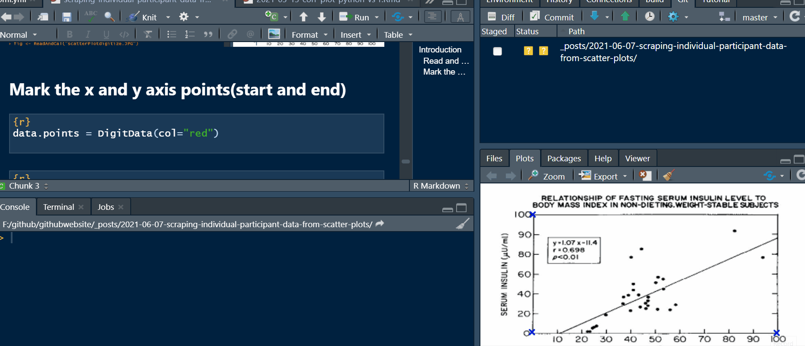
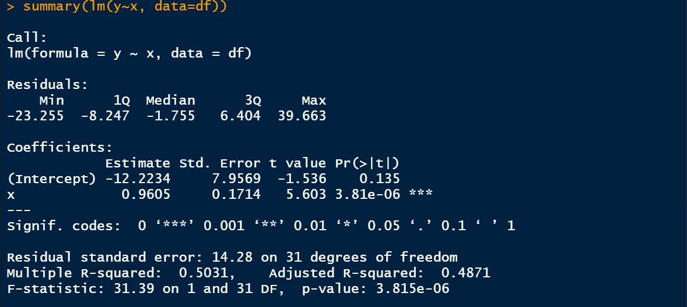

<head>
  <script async src="https://pagead2.googlesyndication.com/pagead/js/adsbygoogle.js?client=ca-pub-4447780400240825" crossorigin="anonymous"></script>
</head>


# Introduction

A scatter plot aka scatter diagram is one of the most commonly used graph to display the relationship between two or more variables. By looking at scatter plots, we can quickly have an insight on whether two or more variables are linearly, negatively/positively or how strongly they are correlated to each other.

Scatter plots are often reported in scientific publications. Though many scientific publications report scatter plots to display relationships, correlation statistics may not be reported along with the scatter plots. Fortunately, scatter plots opens door to open science. With the help of new tools such as [*WebPlotDigitizer*](https://automeris.io/WebPlotDigitizer/) web based point and click software, [*plotdigitizer python*](https://pypi.org/project/plotdigitizer/) python package or the [digitize](https://github.com/tpoisot/digitize) R packages, we can easily digitize scatter plots, scrap individual participant data and estimate correlation values. If you are working in systematic reviews, you may not find all relevant data from the reported papers. You either need to contact the authors or find out mechanisms of estimating values from reported data. I will be back on another blog post on estimating some values from reported data.

# How do we extract values?

I will step by step demonstrate how you can easily extract individual participant data from a scatter plot of an old publication. For detail explanations, please check the following YouTube video. [\<https://www.youtube.com/watch?v=3NI4CyJzJhM&t=344s\>](https://www.youtube.com/watch?v=3NI4CyJzJhM&t=344s){.uri}. I often do R or Python data science tutorials and live coding sessions in my YouTube channel. Please consider subscribing. That will encourage me for sharing more contents.

```{r, eval=knitr::is_html_output(excludes = "epub"), results = 'asis', echo = F}
cat(
'<iframe width="560" height="315" 
  src="https://www.youtube.com/watch?v=3NI4CyJzJhM&t=344s"
  frameborder="0" allow="accelerometer; autoplay; encrypted-media;
  gyroscope; picture-in-picture" allowfullscreen>
  </iframe>'
)
```

The scatter plot that I will use is from the 1994 publication by Strain G. and colleagues. The results are interesting and I invite you reading the paper.


For this blog post, I will be using Fig 1 which shows the relationship of fasting insulin level to BMI in non-dieting weight-stable subjects.


Now, we have what we need and let's go straight to extracting individual participant data from the scatter plot.

What we need to do is take a screen shot of the scatter plot, save it as png or JPG, read it in R, calibrate the x and y axes .

### Read and calibrate the figure (mark the beginning and the end of x and y axis)

```{r, include=TRUE, echo=TRUE, warning=FALSE}
library(digitize)
fig <- ReadAndCal("scatterPlotdigitize.JPG")
```


### Mark data points

```{r, include=TRUE,eval=FALSE, echo=TRUE, warning=FALSE}
data.points = DigitData(col="red")

```



### Extract the data point in a data frame

```{r, include=TRUE,eval=FALSE, echo=TRUE, warning=FALSE}
df <- Calibrate(data.points, fig, 0, 100, 0, 100) #determin where x and y axis values start and end
```


Now we have extracted the x which was BMI and the y (insulin level). We can easily recalculate the correlation and β coefficient values.

```{r, include=TRUE,eval=FALSE, echo=TRUE, warning=FALSE}
cor(df$x, df$y, method = "pearson")
```


Estimate the regression coefficient and compare with the reported value.

```{r, include=TRUE,eval=FALSE, echo=TRUE, warning=FALSE}
summary(lm(y~x, data=df))
```

I estimated the correlation value to be 0.709 and the β coefficient to be about 0.9605. The tiny difference is due to my calibration. If you zoom and carefully calibrate, you can have approximately similar values.



Thank you for reading this post. I hope you find this helpful. For more, subscribe to my [YouTube channel](https://www.youtube.com/channel/UCpHd6O1Yqz4YgcYUBfyRqKg) and follow me on Twitter \@[RPy_DataScience](https://twitter.com/RPy_DataScience).You can also follow me by liking [R_Py Data Science](https://web.facebook.com/R_Py-Data-Science-105325938441990/news_feed) Facebook page.

# Contact

Please mention \@[RPy_DataScience](https://twitter.com/RPy_DataScience) if you tweet this post.
