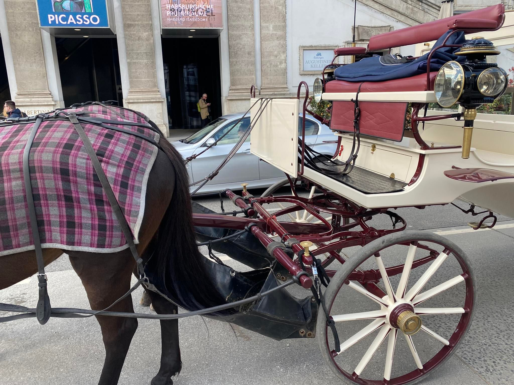
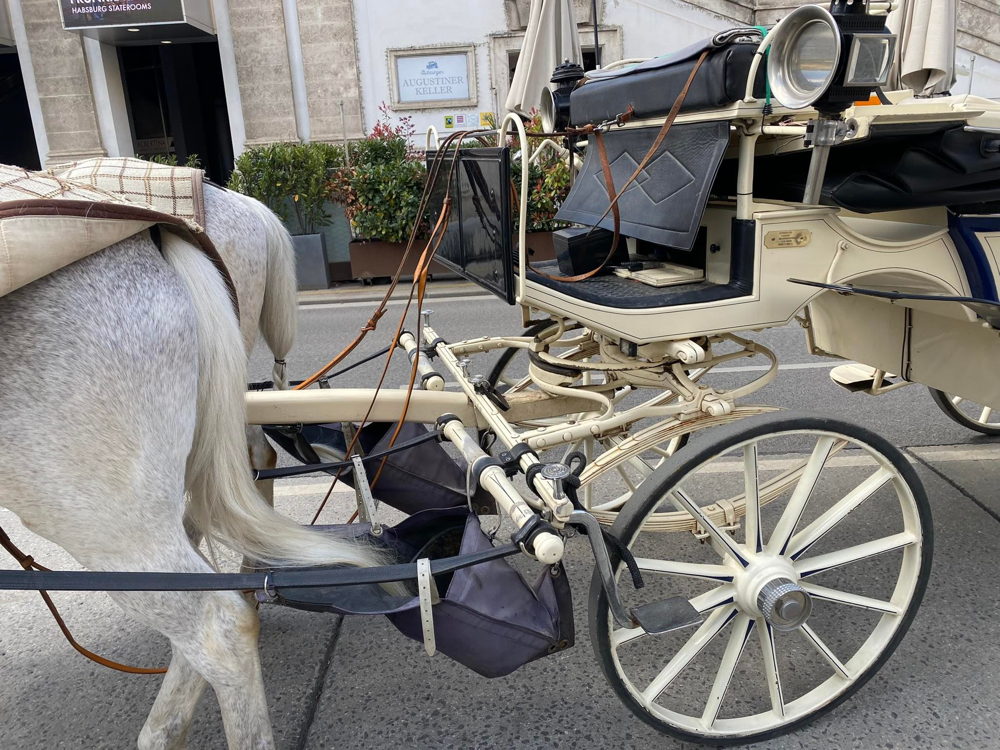
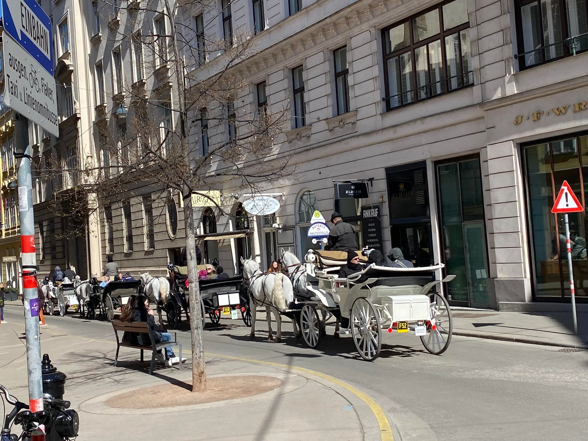

<head>
  <script async src="https://pagead2.googlesyndication.com/pagead/js/adsbygoogle.js?client=ca-pub-4447780400240825" crossorigin="anonymous"></script>
</head>

<link rel="stylesheet" href="styles.css" type="text/css">

በፈረስ የሚጎተት ጋሪ በኢትዮጵያ በተለያዩ ከተሞች ጥቅም ላይ ይውላል። እንዳውም በቅርቡማ በነዳጂ እጥረት ምክንያት አዲስ አበባ ውስጥም በስፋት ጥቅም ላይ አየዋሉ እንደሆነ ይነገራል።

በሁለት ፈረስ የሚሳብ ሰረገላ በአንዳንድ የአውሮጳ ከተሞች በጣም እጂግ ውድ የቅንጦት የትራንስፖርት አማራጭ ነው። ሙሽሮች ሃብታም ቱሪስቶች ሞዴሎችና ሌሎችም አዱኛ ያልሽሻቸው ሰወች በሰረገላ ከተማውን ይጎበኛሉ ፎቶም ይነሱበታል። ሰሞኑን በኦስትሪያ ዋና ከተማ ቪየና እጂግ ብዙ በጣም የሚገርም ውበት ያላቸው ፈረሶችና ሰረገላወች ተመለከትኩ። ይመስለኛል በኦስትርያ ታሪክ ፈረሶች ትልቅ ቦታ አላቸው። ሃውልቶችና ፎቆች ላይ ተቆጠሮ የማያልቅ በጣም ብዙ ቦታ ላይ የፈረስ ሃውልት አለ። በቪየና እምበርት ጎዳናወች ላይ ከሚንፈላሰሱት ሰረገላወች አንዱን ለ40 ደቂቃ ለመጋለብ 95 ዩሮ ያስከፍላሉ። ይህን ሳይ ኢትዮጵያ ውስጥ የምንጠቀምባቸውን ኮሳሳ ፈረሶቻችን ቀልበን ጋሪዎችን ጠጋግነን ለምን አንጠቀም ብየ አሰብኩ። በነገራችን ላይ ጀምስ ብሩስ ኢትዮጵያውያን ፈረሶቻቸው ኮሳሶች እነሱም "They are terrible horsemen" ብሎ ሰድቦናል። ይህ ሆኖም ፈረስ በኢትዮጵያ ታሪክ ትልቅ ባለውለታ እንደሆነ አድዋን ብቻ ማስታወስ በቂ ነው። የአገራችን ንዋየ ቅድሳት የሚደንቁ ጥንታዊ የቤተክርስትያን ስዕሎች የንጉሳችን አልባሳትና ብዙ ወርቅ ልዘረፉን ለእንግሊዝ ወራሪወች መንገድ የጠረገላቸው ስኮትላንዳዊው ብሩስ ጎንደሬዎች ብዙ ቢያደርጉትም አድዋን ሳያይ በማለፉ በጣም ያሳዝናል።

ወላጆቸ እንደነገሩኝ ከሆነ ጋሪ ጎንደር ፒያሳ አካባቢ ድርሽ እንዳይል የተደረገው በደርግ መንግስት ነበር። ለመከልከሉ ዋነኛ ምክንያቱ ደግሞ ፋንድያው ከተማ ያቆሽሻል በሚል ነበር ሲባል ሰምቻለሁ። ይህ ቀላል መላ ነበረው። የሚከተሉት ፎቶወች ላይ ያሉትን ፈረሶች ልብ ብለው ይመልከቱ። ፈረሶቹ ከተማ እንዳያቆሽሹ የተገጠመላቸውን የደረቅ ፋንድያ ማጣራቀሚያውን ተመልከቱ። በጣም ቀላል ነገርግን ከተማን ሳያቆሽሹ እንደዚህ ሰረገላ ወይም ጋሪን መጠቀም ይቻላል። በኛ አገር ጋሪ ያለፈበት ሰፈር ሁሉ የፈረስ ጋጥ ነው የሚመስለው። ይህን መቀየር ከባድ ስራ አይጠይቅም!!








If you have enjoyed reading this, consider subscribing for upcoming posts.

```{r, results='asis', echo=FALSE}
library(htmltools)
html <- '<form action="https://mihiretukebede.us18.list-manage.com/subscribe/post?u=7996931f0da3fa21654a3274b&amp;id=a7cc1788e4&amp;f_id=00252de7f0" method="post" id="mc-embedded-subscribe-form" name="mc-embedded-subscribe-form" class="validate" target="_blank" novalidate>
  <div id="mc_embed_signup_scroll">
    <h2>Subscribe</h2>
    <div class="indicates-required"><span class="asterisk">*</span> indicates required</div>
    <div class="mc-field-group">
      <label for="mce-EMAIL">Email Address  <span class="asterisk">*</span></label>
      <input type="email" value="" name="EMAIL" class="required email" id="mce-EMAIL" required>
      <span id="mce-EMAIL-HELPERTEXT" class="helper_text"></span>
    </div>
    <div id="mce-responses" class="clear foot">
      <div class="response" id="mce-error-response" style="display:none"></div>
      <div class="response" id="mce-success-response" style="display:none"></div>
    </div>  
    <div style="position: absolute; left: -5000px;" aria-hidden="true"><input type="text" name="b_7996931f0da3fa21654a3274b_a7cc1788e4" tabindex="-1" value=""></div>
    <div class="optionalParent">
      <div class="clear foot">
        <input type="submit" value="Subscribe" name="subscribe" id="mc-embedded-subscribe" class="button">
        <p class="brandingLogo"><a href="http://eepurl.com/ioaw72" title="Mailchimp - email marketing made easy and fun"></a></p>
      </div>
    </div>
  </div>
</form>'
HTML(html)
```
