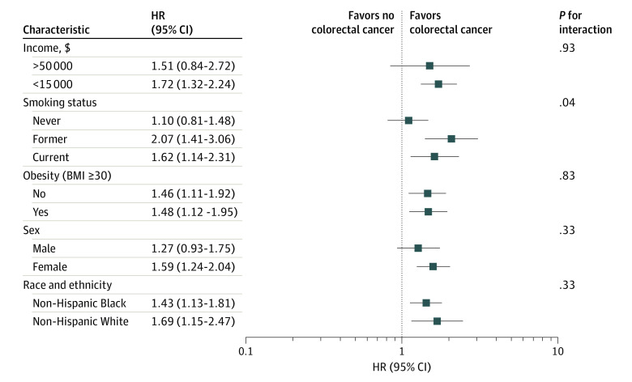

<head>

```{=html}
<script async src="https://pagead2.googlesyndication.com/pagead/js/adsbygoogle.js?client=ca-pub-4447780400240825" crossorigin="anonymous"></script>
```
</head>

------------------------------------------------------------------------

# Why Are We Still Using Endless Tables?

Every week I open papers that bury their main results in wall-to-wall regression tables: dozens of rows, tiny fonts, and confidence intervals that may even require a ruler and patience.

Let's see this elegant forest plot presented in this article: [Association of Income, Smoking, and Other Factors With Colorectal Cancer Risk](https://jamanetwork.com/journals/jama/fullarticle/2817406). It looks nice and easy to read, right? So what is stopping many from presenting regression results like this---clear, visual, and instantly interpretable?



A single figure tells the story: which factors matter, the direction of effect, and the uncertainty---no squinting at page-long tables.

## Getting the Data

This figure contains only a handful of rows, so I simply **typed the numbers by hand** from the article and supplement.\
That guarantees 100 % fidelity.

For larger figures you could automate extraction.\
The `tesseract` package in R can OCR a PDF or PNG:


```{r include=T, echo=TRUE, warning=FALSE, message=FALSE}
library(tesseract)
txt <- ocr("jama.jpg")
cat(txt)
```

…but for eleven lines of data, manual entry wins on speed and accuracy.

```{r include=T, echo=TRUE, warning=FALSE, message=FALSE}
df <- data.frame(
  variable = c("Income, $", "Income, $", "Smoking", "Smoking", "Smoking",
               "Obesity", "Obesity", "Sex", "Sex",
               "Race and ethnicity", "Race and ethnicity"),
  characteristic = c(">50000", "<15000", "Never", "Former", "Current",
                     "No", "Yes", "Male", "Female",
                     "Non-Hispanic Black", "Non-Hispanic White"),
  HR    = c(1.51, 1.72, 1.10, 2.07, 1.62, 1.46, 1.48, 1.27, 1.59, 1.43, 1.69),
  lower = c(0.84, 1.32, 0.81, 1.41, 1.14, 1.11, 1.12, 0.93, 1.24, 1.13, 1.15),
  upper = c(2.72, 2.24, 1.48, 3.06, 2.31, 1.92, 1.95, 1.75, 2.04, 1.81, 2.47),
  p_value = c(0.93, NA, 0.04, NA, NA, 0.83, NA, 0.33, NA, 0.33, NA)
)

df$HR_CI <- sprintf("%.2f (%.2f–%.2f)", df$HR, df$lower, df$upper)
df

```

# Reproducing the Plot in R

The meta package is designed for meta-analysis,
but its forest() function is perfect for any list of estimates once pooling is turned off.

```{r include=T, echo=TRUE, warning=FALSE, message=FALSE}
library(meta)

all <- metagen(
  TE = log(df$HR),
  lower = log(df$lower),
  upper = log(df$upper),
  subgroup = df$variable,
  data = df,
  sm = "HR",
  common = FALSE,
  overall = FALSE,
  random = FALSE,
  backtransf = TRUE
)

forest(all,
       leftcols  = c("characteristic", "HR_CI"),
       leftlabs  = c("Characteristic", "HR (95% CI)"),
       rightcols = "p_value",
       rightlabs = "P for interaction",
       col.square = "darkgreen",
       weight.study = "same",
       label.left  = "Favours no colorectal cancer",
       label.right = "Favours colorectal cancer",
       fontsize=7, squaresize = 0.6,
       spacing = 0.7,
       subgroup.name = ""
       )
```


Take-Home Message

Visuals persuade. A forest plot conveys magnitude, direction, and uncertainty at a glance.

Readers remember pictures, not tables.

If your model fits in a table, it fits in a figure—and your audience will thank you.

So the next time you’re tempted to drop a 12-column regression table into your manuscript,
ask yourself: why not a forest plot?

Stop drowning readers in tables—start communicating with figures.

Image credit: Figure 1 from the cited JAMA article.

If you have enjoyed reading this blog post, consider subscribing for upcoming posts. 


```{r, results='asis', echo=FALSE}
library(htmltools)
html <- '<form action="https://mihiretukebede.us18.list-manage.com/subscribe/post?u=7996931f0da3fa21654a3274b&amp;id=a7cc1788e4&amp;f_id=00252de7f0" method="post" id="mc-embedded-subscribe-form" name="mc-embedded-subscribe-form" class="validate" target="_blank" novalidate>
  <div id="mc_embed_signup_scroll">
    <h2>Subscribe</h2>
    <div class="indicates-required"><span class="asterisk">*</span> indicates required</div>
    <div class="mc-field-group">
      <label for="mce-EMAIL">Email Address  <span class="asterisk">*</span></label>
      <input type="email" value="" name="EMAIL" class="required email" id="mce-EMAIL" required>
      <span id="mce-EMAIL-HELPERTEXT" class="helper_text"></span>
    </div>
    <div id="mce-responses" class="clear foot">
      <div class="response" id="mce-error-response" style="display:none"></div>
      <div class="response" id="mce-success-response" style="display:none"></div>
    </div>  
    <div style="position: absolute; left: -5000px;" aria-hidden="true"><input type="text" name="b_7996931f0da3fa21654a3274b_a7cc1788e4" tabindex="-1" value=""></div>
    <div class="optionalParent">
      <div class="clear foot">
        <input type="submit" value="Subscribe" name="subscribe" id="mc-embedded-subscribe" class="button">
        <p class="brandingLogo"><a href="http://eepurl.com/ioaw72" title="Mailchimp - email marketing made easy and fun"></a></p>
      </div>
    </div>
  </div>
</form>'
HTML(html)
```
