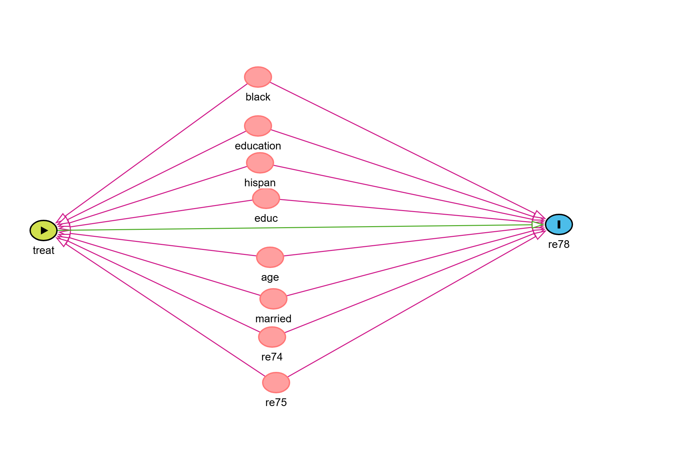

<head>

```{=html}
<script async src="https://pagead2.googlesyndication.com/pagead/js/adsbygoogle.js?client=ca-pub-4447780400240825" crossorigin="anonymous"></script>
```
</head>

# Introduction

In randomized control trials, treatment assignment is random and
independent of potential confounders. Ignorability or exchangebility
assumption are fulfilled. Determining average causal effects is,
therefore, straightforward. However, in observational studies treatment
assignment is not random. This makes determining the causal effects of
treatment difficult. Individuals get assigned to certain treatment based
on their conditions or background characteristics. These characteristics
will influence both treatment and outcome and create confounding. There
fore the estimated effects sizes will be biased and may be far from
causal effects

Let

-   $T \in \{0,1\}$ be the treatment,\
-   $Y$ be the observed outcome,\
-   $X$ be the set of baseline covariates,\
-   $Y(1)$ and $Y(0)$ be potential outcomes under treatment and control.

The individual level causal effect is

$$
\tau = Y(1) - Y(0)
$$

but only one potential outcome is observed for each individual.This is
the fundamental problem of potential outcomes scenario.

If we compare outcomes without adjustment:

$$
E[Y \mid T=1] - E[Y \mid T=0]
$$

the difference is generally biased because the groups differ in
covariates.

## Confounding as a backdoor path

A confounder affects both treatment and outcome. This creates a backdoor
path:

$$
T \leftarrow X \to Y
$$

To identify causal effects, we assume **conditional exchangeability**:

$$
Y(1), Y(0) \perp T \mid X
$$

meaning that, being assigned to either of the treatment arms is as good
as random assignment given the set of potential
confounders(X).Therefore, after properly adjusting for relevant
covariates(potential confounders), treatment assignment can be close to
or as good as random. This is called **conditional exchangeabilty** or
**conditional ignorability** or **causal sufficiency**.

## The propensity score matching method

Propensnsity score is the probality of being asigned to treatment. More
formally, the **propensity score** (Rosenbaum and Rubin 1983) is defined
as:

$$
e(X) = P(T = 1 \mid X)
$$

If exchangeability holds given𝑋, then it also holds given the scalar
$$e(X)$$

$$
Y(1), Y(0) \perp T \mid e(X)
$$

This means that conditioning on a single scalar(score) $e(X)$ is
sufficient to remove confounding due to all observed covariates in $X$.

### Goal of Propensity Score Matching

Propensity Score Matching (PSM) matches treated individuals with control
individuals using propensity scores, creating a balanced sample. After
matching, the **Average Treatment Effect on the Treated (ATT)** is
simply estimated as:

$$
ATT = E[Y(1) - Y(0) \mid T = 1]
$$

For this tutorial, I will use the Lalonde Dataset. The data sets has 445
observations with 185 treated and 260 control subjects, and 10
variables.

-   `treatment` (1 = treated; 0 = control) (Training program)

-   `age`, measured in years;

-   `education` , measured in years;

-   `black` , indicating race (1 if black, 0 otherwise);

-   `hispanic`, indicating race (1 if Hispanic, 0 otherwise);

-   `married`, indicating marital status (1 if married, 0 otherwise);

-   `nondegree`, indicating high school diploma (1 if no degree, 0
    otherwise);

-   `re74`, real earnings in 1974;

-   `re75` , real earnings in 1975.

The last variabele is `treatment` , the real the earnings in 1978. That
is our outcome variable. You may take a look at the datasets and the
source
[here](https://search.r-project.org/CRAN/refmans/designmatch/html/lalonde.html).

Before we dive into the analysis, we will construct the DAG for this. We
want to see whether the treatment (training program) has an effect on
earning(`re78)`. To construct DAG, I used the web-based DAGITTY package.
You can also use the *dagitty* R-package. I found the web-version easier
to adjust the plot. We have a simple DAG plot. All of the 9 confounders
are connected to both treatment and the outcome, These are classic set
of confounders. The aim of matching is to block all backdoor paths from
treatment exposure( `treat)` to outcome(`re78)` by balancing on these
covariates.



Mow let's proceed to the analysis.

```{r include=T, echo=TRUE, warning=FALSE, message=FALSE}
library(tableone) # for easy
library(Matching)
library(MatchIt)

data(lalonde) #load the dataset
df <- lalonde
table(df$race) 
# Create race indicators
df$black <- as.numeric(df$race == "black")
df$hispan <- as.numeric(df$race == "hispan")

# Confounders: let's call them xvars
xvars <- c("age", "educ", "black", "hispan",
           "married", "nodegree", "re74", "re75")

# Table 1 before matching
table1_before <- CreateTableOne(vars = xvars, data = df, strata = "treat", test = FALSE)
print(table1_before, smd = TRUE)

```

The standardized mean differences show imbalance in several baseline
covariates. This is why we need to balance. PSM is needed.

# Greedy Matching on Covariates

Greedy matching also known as nearest neighbor matching. It uses
Mahalanobis distance, Euclidean distance or propensity scores. Fore more
details, check the [Matchit
package](https://cran.r-project.org/web/packages/MatchIt/vignettes/matching-methods.html#specifying-the-propensity-score-or-other-distance-measure-distance)

```{r include=T, echo=TRUE, warning=FALSE, message=FALSE}
greedy_match <- Match(Tr = df$treat, M = 1, X = df[xvars])
matched1 <- df[unlist(greedy_match[c("index.treated", "index.control")]),]

table_greedy <- CreateTableOne(vars = xvars, data = matched1,
                               strata = "treat", test = FALSE)
print(table_greedy, smd = TRUE)
```

As you can see, greedy matching has already greatly achieved matching. However, matching directly on the covariates improves balance but may not be optimal. Propensity score matching usually performs better.

# Estimate the Propensity Score

Estimating propensity score is simply done by doing logistic regression of treatment variable on the set of confounders. 

```{r include=T, echo=TRUE, warning=FALSE, message=FALSE}
psmodel1 <- glm(treat ~ age + educ + black + 
                  hispan + married + nodegree +
                  re74 + re75, family =
                  binomial(), data = df)

df$pscore <- psmodel1$fitted.values
```

## Check overlap 
```{r include=T, echo=TRUE, warning=FALSE, message=FALSE}
library(ggplot2)

ggplot(df, aes(x = pscore, fill = factor(treat))) +
  geom_histogram(alpha = 0.4, position = "identity", bins = 30) +
  labs(title = "Propensity score distribution before matching",
       fill = "Treatment", x = "Propensity score")

```

Then let's do the matching and check the plot after matching

```{r include=T, echo=TRUE, warning=FALSE, message=FALSE}
m.out1 <- matchit(treat ~ age + educ + black + hispan + married +
                    nodegree + re74 + re75,
                  data = df, method = "nearest")

summary(m.out1)
matched_df <- match.data(m.out1) # we create our full matched datset

```

Then check the plot after matching

```{r include=T, echo=TRUE, warning=FALSE, message=FALSE}
ggplot(matched_df, aes(x = pscore, fill = factor(treat))) +
  geom_histogram(alpha = 0.4, position = "identity", bins = 30) +
  labs(title = "Propensity score distribution after matching",
       fill = "Treatment", x = "Propensity score")

```

Let's now check smd for the PSM-matched datasets. 

```{r include=T, echo=TRUE, warning=FALSE, message=FALSE}
table_psm_matched <- CreateTableOne(vars = xvars, data = matched_df,
                               strata = "treat", test = FALSE)
print(table_psm_matched, smd = TRUE)
```

Check covariate balance using Love plot

```{r include=T, echo=TRUE, warning=FALSE, message=FALSE}
library(cobalt)

love.plot(m.out1, stats = "mean.diffs",
          threshold = 0.1, abs = TRUE,
          var.order = "unadjusted")

```


As you can see most standardized mean differences drop below 0.1 after matching. This shows good covariate balance is achieved and we can move on to our causal effect calculations.

## Otcome analysis 
We use paired t-test to evaluate the outcome data on our PSM-matched datset.

```{r include=T, echo=TRUE, warning=FALSE, message=FALSE}
y_trt <- matched_df$re78[matched_df$treat == 1]
y_ctrl <- matched_df$re78[matched_df$treat == 0]

t.test(y_trt, y_ctrl, paired = TRUE)

```

The difference in means is the Average Treatment Effect on the Treated (ATT). This estimate reflects the causal effect of the training program on those who participated, under the assumption that all confounders have been adequately balanced.


## PSM using caliper
Caliper matching prevents poor matches and often improves covariate balance even further. This is simply achieved by setting caliper value from the Match() function. 

```{r include=T, echo=TRUE, warning=FALSE, message=FALSE}
pscore1 <- df$pscore

psmatch2 <- Match(Tr = df$treat, M = 1, X = log(pscore1),
                  replace = FALSE, caliper = 0.1)

matched2 <- df[unlist(psmatch2[c("index.treated", "index.control")]),]

table_caliper <- CreateTableOne(vars = xvars, strata = "treat", test = FALSE,
                                data = matched2)
print(table_caliper, smd = TRUE)

```
From the smd, values setting the caliper has achieved a better balance but smaller sample size. More unmatched observations are dropped. 

Now, outcome analysis after matching using caliper 

```{r include=T, echo=TRUE, warning=FALSE, message=FALSE}
y_trt <- matched2$re78[matched2$treat == 1]
y_ctrl <- matched2$re78[matched2$treat == 0]

t.test(y_trt, y_ctrl, paired = TRUE)

```

The mean of the differences 1300(95%CI: -340, 2942) is our final causal estimate. It tells us how much the training program increased the average post intervention earnings among participants.However, the 96%CI includes 0. Hence no causal effect of the treatment(training programs) on post intervention earnings! 

In summary, we have seen observational treatment assignment creates confounding and the propensity score summarizes multiple confounders into a single scalar value and can help us achieve a matched dataset. This dataset can be much lower than the original unmatched dataset. Matching discards unmatched subjects (often many), leading to: reduced precision. weaker generalizability,and possibly losing a rare treatment subgroup.  In contrast to PSM, Inverse Probability of Treatment Weighting (IPTW) offers an attractive alternative that avoids discarding subjects. Instead of removing unmatched individuals, IPTW reweights each observation by the inverse of its probability of receiving the treatment(1/propensity score value for treated and 1/(1-propensity score value for control subjects)) actually observed. That will be my next post. 

After matching, the difference in outcomes can be interpreted as a causal effect for treated individuals.

If you have enjoyed reading this, consider subscribing for
upcoming posts.

```{r, results='asis', echo=FALSE}
library(htmltools)
html <- '<form action="https://mihiretukebede.us18.list-manage.com/subscribe/post?u=7996931f0da3fa21654a3274b&amp;id=a7cc1788e4&amp;f_id=00252de7f0" method="post" id="mc-embedded-subscribe-form" name="mc-embedded-subscribe-form" class="validate" target="_blank" novalidate>
  <div id="mc_embed_signup_scroll">
    <h2>Subscribe</h2>
    <div class="indicates-required"><span class="asterisk">*</span> indicates required</div>
    <div class="mc-field-group">
      <label for="mce-EMAIL">Email Address  <span class="asterisk">*</span></label>
      <input type="email" value="" name="EMAIL" class="required email" id="mce-EMAIL" required>
      <span id="mce-EMAIL-HELPERTEXT" class="helper_text"></span>
    </div>
    <div id="mce-responses" class="clear foot">
      <div class="response" id="mce-error-response" style="display:none"></div>
      <div class="response" id="mce-success-response" style="display:none"></div>
    </div>  
    <div style="position: absolute; left: -5000px;" aria-hidden="true"><input type="text" name="b_7996931f0da3fa21654a3274b_a7cc1788e4" tabindex="-1" value=""></div>
    <div class="optionalParent">
      <div class="clear foot">
        <input type="submit" value="Subscribe" name="subscribe" id="mc-embedded-subscribe" class="button">
        <p class="brandingLogo"><a href="http://eepurl.com/ioaw72" title="Mailchimp - email marketing made easy and fun"></a></p>
      </div>
    </div>
  </div>
</form>'
HTML(html)
```
