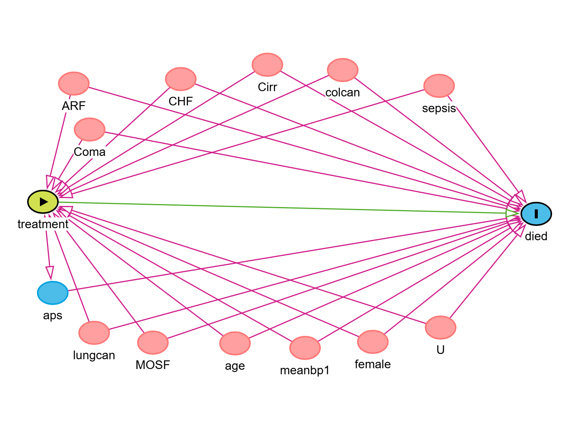

<head>

```{=html}
<script async src="https://pagead2.googlesyndication.com/pagead/js/adsbygoogle.js?client=ca-pub-4447780400240825" crossorigin="anonymous"></script>
```
</head>

# Introduction

In my previous post I demonstrated, propensity score matching method for covariate balancing and estimating the average causal effects of treatments from observational studies. we have seen treatment assignm

The truncated analysis trades a small amount of bias for improved precision and numerical stability.

ent in observational setting is no random and this creates confounding. The propensity score effectively summarizes multiple confounders into a single scalar value. That scalar value(X) can help us achieve a matched data sets. While finding the matched observations, we have to discard unmatched individuals from our sample. Therefore the data sets can be much lower than the original unmatched data sets leading to: reduced precision. weaker generalizability,and possibly losing rare treatment subgroups.

In contrast to propensity score matching, Inverse Probability of Treatment Weighting (IPTW) offers an attractive solution and avoids discarding subjects. Instead of removing unmatched individuals, IPTW re-weights each observation by the inverse of its probability of receiving the treatment (1/propensity score value for the treated and 1/(1-propensity score value for control subjects)).

In addition, observational studies, treatment is often associated with prognosis even after conditioning on baseline covariates. This is especially problematic in longitudinal settings, where treatment and covariates both change over time and influence each other.

Classical regression adjustment can fail in the presence of **treatment--covariate feedback**. Adjusting for time varying covariates in tradional regression adjustments may block part of the treatment effect and introduce bias. **Inverse Probability of Treatment Weighting (IPTW)** and **Marginal Structural Models (MSM)** offer an effective method to tackle this bias. In this post, we focus on the single time point case, which will illustrate the key ideas. The extension to time varying treatment follows the same logic.

## Causal framework

Let

-   $T \in \{0,1\}$ be the treatment indicator,\
-   $Y$ be the observed outcome,\
-   $X$ be a vector of baseline covariates,\
-   $Y(1)$ and $Y(0)$ be the potential outcomes under treatment and control.

The causal effects of interest are, for example:

-   **Average treatment effect (ATE)**\
    $$
    ATE = E[Y(1) - Y(0)]
    $$

-   **Average treatment effect on the treated (ATT)**\
    $$
    ATT = E[Y(1) - Y(0) \mid T = 1]
    $$

In the single time point setting, the key assumption is again conditional exchangeability:

$$
Y(1), Y(0) \perp T \mid X
$$

## Inverse probability weights

The **propensity score** is

$$
e(X) = P(T = 1 \mid X)
$$

IPTW will help us create a **weighted pseudo population** in which treatment is independent of measured covariates. For the ATE, the basic unstabilized weights are

$$
w_i =
\begin{cases}
\frac{1}{e(X_i)} & \text{if } T_i = 1 \\
\frac{1}{1 - e(X_i)} & \text{if } T_i = 0
\end{cases}
$$

In this pseudo population, treated and untreated individuals have the same distribution of the scalar $X$, so simple weighted comparisons of outcomes can be unbiased for the marginal causal effect, under the usual assumptions.

In practice, we often use **stabilised weights** to reduce variance, and we often **truncate** extreme weights to improve numerical stability.

## Marginal structural models

A **Marginal Structural Model (MSM)** models the relationship between treatment and potential outcomes at the population level. For a binary treatment and outcome $Y$, a simple MSM can be modelled as

$$
g\{ E[Y^a] \} = \beta_0 + \beta_1 a
$$

where

-   $a \in \{0,1\}$ is the treatment levels,\
-   $g$ is the link function (identity, log, or logit),\
-   $\beta_1$ encodes the causal effect.

We fit MSM using **weighted regression** with IPTW. The weights make treatment independent of the covariates (X), so the regression captures the **marginal** causal effect rather than a conditional association.

-   With **identity link** for a binary outcome, $\beta_1$ is a **causal risk difference**.\
-   With **log link**, $\exp(\beta_1)$ is a **causal risk ratio**.\
-   With **logit link**, $\exp(\beta_1)$ is a **causal odds ratio**.

For a **continuous outcome**, we use a Gaussian model with identity link and interpret $\beta_1$ as a causal mean difference (MD).

# DAG for the RHC example

Let's draw a DAG for our example dataset. We use a right heart catheterization (RHC) example. Let `treatment` indicate whether a patient received RHC in the ICU, and `died` indicate death. Several baseline characteristics affect both the decision to perform RHC and the risk of death.



The DAG shows that comorbidities and severity markers are confounders for the effect of RHC on mortality. IPTW uses these variables to construct a pseudo population where treatment is independent of these confounders. Now let's proceed to our analysis.

Load data and prepare variables

```{r include=T, echo=TRUE, warning=FALSE, message=FALSE}

# install.packages("tableone", repos = "https://cloud.r-project.org")
# install.packages("ipw", repos = "https://cloud.r-project.org")
# install.packages("sandwich", repos = "https://cloud.r-project.org")
# install.packages("survey", repos = "https://cloud.r-project.org")
# install.packages("cobalt", repos = "https://cloud.r-project.org")
library(dplyr)
library(tableone) # for showing the SMD values
library(ipw) #for running iptw
library(sandwich)  # robust variance
library(survey)
library(cobalt)

# Load example data
load(url("https://hbiostat.org/data/repo/rhc.sav"))

# Create binary indicators and numeric variables
mydata <- rhc %>% 
  mutate(
    ARF     = as.numeric(cat1 == "ARF"),
    CHF     = as.numeric(cat1 == "CHF"),
    Cirr    = as.numeric(cat1 == "Cirrhosis"),
    colcan  = as.numeric(cat1 == "Colon Cancer"),
    Coma    = as.numeric(cat1 == "Coma"),
    lungcan = as.numeric(cat1 == "Lung Cancer"),
    MOSF    = as.numeric(cat1 == "MOSF w/Malignancy"),
    sepsis  = as.numeric(cat1 == "MOSF w/Sepsis"),
    female  = as.numeric(sex == "Female"),
    died    = as.numeric(death == "Yes"),
    treatment = as.numeric(swang1 == "RHC"),
    meanbp1 = rhc$meanbp1,
    aps     = rhc$aps1
  ) %>% 
  select(
    ARF, CHF, Cirr, colcan, Coma, lungcan, MOSF, sepsis,
    age, female, meanbp1, aps, treatment, died
  )

```

Unweighted baseline characteristics

```{r include=T, echo=TRUE, warning=FALSE, message=FALSE}
xvars <- c("ARF", "CHF", "Cirr", "colcan", "Coma",
           "lungcan", "MOSF", "sepsis",
           "age", "female", "meanbp1", "aps")

table_unw <- CreateTableOne(vars = xvars, strata = "treatment",
                            data = mydata, test = FALSE)
print(table_unw, smd = TRUE)
```

As you can see from the SMDs, there is imbalance it some of our prognostic variables (SMD\>0.1) between patients who did and did not receive RHC.

# Propensity score model

As we did in my previous tutorial, let's now do the PSM model.

```{r include=T, echo=TRUE, warning=FALSE, message=FALSE}
psmodel <- glm(treatment ~ age + female + meanbp1 +
                 ARF + CHF + Cirr + colcan +
                 Coma + lungcan + MOSF + sepsis,
               family = binomial(link = "logit"),
               data = mydata)

summary(psmodel)
ps <- predict(psmodel, type = "response")
ps[1:5] #To see the propensity score vales for five observations

```

We now estimated the propensity score `ps` values for the observations which is the probability of receiving RHC treatment given our baseline covariates (age + female, meanbp1, ARF, CHF, Cirr , colcan ,Coma , lungcan, MOSF ,sepsis).

# Construct IPTW weights

With the following code, we calculate the unstabilied weights. We calculate these weights by simply taking the reciprocal of the propensity(1/ps) scores for the the ones who didn't receive the treatment and 1/(1-ps) for the those subjects who didn't receive the treatment.

```{r include=T, echo=TRUE, warning=FALSE, message=FALSE}
#Unstabilised ATE weights
w_iptw <- ifelse(mydata$treatment == 1, 
                 1 / ps, 1/(1 - ps))

summary(w_iptw)

```

These weights help us create a pseudo population in which treatment assignment is independent of the measured confounders, under our causal assumptions.

# Weighted covariate balance

```{r include=T, echo=TRUE, warning=FALSE, message=FALSE}
design_w <- svydesign(ids = ~1, data = mydata, weights = ~w_iptw)

table_w <- svyCreateTableOne(vars = xvars, strata = "treatment",
                             data = design_w, test = FALSE)
print(table_w, smd = TRUE)
```

We can see the SMDs are now closer to zero which tells us that we have improved the balance.

## Visualize using love plot before and after weighting

```{r include=T, echo=TRUE, warning=FALSE, message=FALSE}
# Using cobalt directly with weights
bal_iptw <- bal.tab(treatment ~ ARF + CHF + Cirr + 
                      colcan + Coma +lungcan + MOSF + sepsis +
                      age + female + meanbp1 + aps,
                    data = mydata,
                    weights = w_iptw,
                    estimand = "ATE")

love.plot(bal_iptw, stats = "mean.diffs",
          abs = TRUE, threshold = 0.1)
```

The love plot shows how IPTW reduces imbalance. Absolute mean difference below 0.1 are usually considered acceptable.

# MSM: estimating causal risk ratio and risk difference

### Causal risk ratio (log link)

To estimate the causal risk RR, we run a regression of the outcome variable (died) as a function of the treatment variable. We add our iptw weights in the glm. After that we will already have the coefficients.

`The vcovHC()` from the **sandwich** package computes a **heteroskedasticity-consistent variance--covariance matrix**. It tels to use the Basic sandwitch method to calculate the SE. `HC0`works well and is default for large samples. For small samples, `HC3` is often used. Once we have the `SE` of our estimate `𝞫` , calculating the causal RR and its `95%CI` is straightforward.

```{r include=T, echo=TRUE, warning=FALSE, message=FALSE}
glm_rr <- glm(died ~ treatment,
              weights = w_iptw,
              family = binomial(link = "log"),
              data = mydata)

beta_rr <- coef(glm_rr)
SE_rr   <- sqrt(diag(vcovHC(glm_rr, type = "HC0")))

causal_rr <- exp(beta_rr["treatment"])
lcl_rr    <- exp(beta_rr["treatment"] - 1.96 * SE_rr["treatment"])
ucl_rr    <- exp(beta_rr["treatment"] + 1.96 * SE_rr["treatment"])

c(RR = causal_rr, LCL = lcl_rr, UCL = ucl_rr)
```

Here exp⁡(β1)\exp(\beta_1)exp(β1​) is the **marginal causal risk ratio** for death comparing RHC to no RHC in the weighted pseudo population. You can see the treatment increase death by 8%.

## Causal risk difference (identity link)

To calculate the causal risk difference, we run similar analysis as above but we now set the link function to `identity`. The rest is simple.

```{r include=T, echo=TRUE, warning=FALSE, message=FALSE}
glm_rd <- glm(died ~ treatment,
              weights = w_iptw,
              family = binomial(link = "identity"),
              data = mydata)

beta_rd <- coef(glm_rd)
SE_rd   <- sqrt(diag(vcovHC(glm_rd, type = "HC0")))

causal_rd <- beta_rd["treatment"]
lcl_rd    <- beta_rd["treatment"] - 1.96 * SE_rd["treatment"]
ucl_rd    <- beta_rd["treatment"] + 1.96 * SE_rd["treatment"]

c(RD = causal_rd, LCL = lcl_rd, UCL = ucl_rd)
```

Here β1\beta_1β1​ is the **marginal causal risk difference**. A negative value tells us that treatment reduces risk, a positive value indicates increased risk. We found the causal risk difference of 0.051 which indicates catheterization leads to an estimated 5.15 percent absolute increase in the risk of death, under the assumptions of the MSM.

```{r include=T, echo=TRUE, warning=FALSE, message=FALSE}
library(ggplot2)

ggplot(mydata, aes(x = w_iptw)) +
  geom_histogram(bins = 50) +
  labs(x = "IPTW weight",
       title = "Distribution of unstabilised IPTW weights") +
  theme_minimal()
```

As you can see from the plot, we have some extreme value of `iptw` weights. Larger weights in Inverse Probability of Treatment Weighting indicate that specific observations in the study have a low probability of receiving the treatment they actually received given the set of covariates. These extreme weights mean that a few, often unrepresentative, observations are heavily driving the causal effect estimate, which can lead to high variance, increased bias, and unstable results. A small number of extreme weights can dominate the analysis and increase variance. So we need to truncate these weights to reduce this driver bias.

# Truncating extreme weights

We can truncate extreme weights to reduce instability. We remove the ones having weights of more than 10 and then we redo our causal RR and RD calculations.

```{r include=T, echo=TRUE, warning=FALSE, message=FALSE}
# Truncate at 10
w_trunc <- ifelse(w_iptw > 10, 10, w_iptw)

summary(w_trunc)

ggplot(mydata, aes(x = w_trunc)) +
  geom_histogram(bins = 50) +
  labs(x = "Truncated IPTW weight",
       title = "Distribution of truncated IPTW weights") +
  theme_minimal()
```

# MSM with truncated weights

```{r include=T, echo=TRUE, warning=FALSE, message=FALSE}
glm_rr <- glm(died ~ treatment,
              weights = w_trunc,
              family = binomial(link = "log"),
              data = mydata)

beta_rr <- coef(glm_rr)
SE_rr   <- sqrt(diag(vcovHC(glm_rr, type = "HC0")))

causal_rr <- exp(beta_rr["treatment"])
lcl_rr    <- exp(beta_rr["treatment"] - 1.96 * SE_rr["treatment"])
ucl_rr    <- exp(beta_rr["treatment"] + 1.96 * SE_rr["treatment"])

c(RR = causal_rr, LCL = lcl_rr, UCL = ucl_rr)
```

Comparing it with our previous causal RR estimate, you can see the one calculated using the truncated weights has more precission.

```{r include=T, echo=TRUE, warning=FALSE, message=FALSE}
glm_rd_trunc <- glm(died ~ treatment,
                    weights = w_trunc,
                    family = binomial(link = "identity"),
                    data = mydata)

beta_rd_trunc <- coef(glm_rd_trunc)
SE_rd_trunc   <- sqrt(diag(vcovHC(glm_rd_trunc, type = "HC0")))

causal_rd_trunc <- beta_rd_trunc["treatment"]
lcl_rd_trunc    <- beta_rd_trunc["treatment"] - 1.96 * SE_rd_trunc["treatment"]
ucl_rd_trunc    <- beta_rd_trunc["treatment"] + 1.96 * SE_rd_trunc["treatment"]

c(RD = causal_rd_trunc, LCL = lcl_rd_trunc, UCL = ucl_rd_trunc)
```

Similar to what we observed in our causal RR estimates using the truncated weights, our causal risk difference estimate after removing observations with extreme `iptw` gives us a more precise estimate. Therefore, the truncated analysis provides us improved precision and numerical stability.

# Using the `ipw` package

We can also the calculate the weights using the `ipw` package.

```{r include=T, echo=TRUE, warning=FALSE, message=FALSE}
weightmodel <- ipwpoint(
  exposure   = treatment,
  family     = "binomial",
  link       = "logit",
  denominator = ~ age + female + meanbp1 +
                  ARF + CHF + Cirr + colcan +
                  Coma + lungcan + MOSF + sepsis,
  data       = mydata
)

summary(weightmodel$ipw.weights)

ipwplot(weights = weightmodel$ipw.weights,
        logscale = FALSE,
        main = "IPW weights from ipwpoint",
        xlim = c(0, 22))
```

## MSM using `survey` with these weights

We can the run our marginal structural model and obtain similar results using the survey package.

## How to get the causal risk ratio (RR)

```{r}
# Survey design for MSM
mydata$w_ipw <- weightmodel$ipw.weights #we attache the weights to our data frame
design_ipw <- svydesign(ids = ~1, weights = ~w_ipw, data = mydata)

# MSM with log link to get causal RR
msm_rr <- svyglm(died ~ treatment,
                 design = design_ipw,
                 family = quasibinomial(link = "log"))

# Extract causal RR
RR <- exp(coef(msm_rr)["treatment"])
CI <- exp(confint(msm_rr)["treatment", ])

RR
CI
```

## Causal risk difference

```{r  include=T, echo=TRUE, warning=FALSE, message=FALSE}
design_ipw <- svydesign(ids = ~1, weights = ~w_ipw, data = mydata)

msm_ipw <- svyglm(died ~ treatment, design = design_ipw,
                  family = quasibinomial(link = "identity"))

coef(msm_ipw)
confint(msm_ipw)
#Let's print ignoring the intercept
coef(msm_ipw)["treatment"]
confint(msm_ipw)["treatment",]
```

The coefficient for `treatment` again represents the marginal causal risk difference. However, we didn't truncate the weights.

# Truncated weights using`ipwpoint`

```{r  include=T, echo=TRUE, warning=FALSE, message=FALSE}
weightmodel_trunc <- ipwpoint(
  exposure   = treatment,
  family     = "binomial",
  link       = "logit",
  denominator = ~ age + female + meanbp1 +
                  ARF + CHF + Cirr + colcan +
                  Coma + lungcan + MOSF + sepsis,
  data       = mydata,
  trunc      = 0.01   # trims at 1st and 99th percentile
)

summary(weightmodel_trunc$weights.trunc)

ipwplot(weights = weightmodel_trunc$weights.trunc,
        logscale = FALSE,
        main = "Truncated IPW weights",
        xlim = c(0, 22))


```

We proceed to calculating causal RR and causal odds ratio using the truncated weights

```{r include=T, echo=TRUE, warning=FALSE, message=FALSE}
mydata$w_trunc_ipw <- weightmodel_trunc$weights.trunc

design_trunc <- svydesign(ids = ~1, weights = ~w_trunc_ipw, data = mydata) #use the truncated weights

msm_rr <- svyglm(died ~ treatment,
                 design = design_ipw,
                 family = quasibinomial(link = "log"))

# Extract causal RR
exp(coef(msm_rr)["treatment"])
exp(confint(msm_rr)["treatment", ])

paste(
  "Causal RR:", round(exp(coef(msm_rr)["treatment"]),3), 
",", "95%CI:","(",
round(exp(confint(msm_rr)["treatment", ])[1],3), ",",
round(exp(confint(msm_rr)["treatment", ])[2],3), ")") #lower and upper

#Risk difference
msm_trunc <- svyglm(died ~ treatment, design = design_trunc,
                    family = quasibinomial(link = "identity"))

coef_rd <- coef(msm_trunc)["treatment"] |>round(4)
confint_rd <- confint(msm_trunc)["treatment",] |>round(4)

paste("Causal RD:", coef_rd, ",", "95%CI:","(",
      confint_rd[1], ",",
      confint_rd[2], ")") #lower and upper
```

Until now, we have seen how to compute causal risk ration and causal risk difference using two different methods. The outcome variable was death (`died)` which was binary outcome. We have seen comparable output using the two methods. How about continuous outcome? We follow the same procedure for continuous outcomes Y. The steps are identical:

1.  Fit a propensity score model for treatment.

2.   Construct IPTW weights.

3.   Fit a weighted MSM with a Gaussian outcome model

Our causal effect measure will be `marginal causal mean difference`.

We can do this using the `lalonde` dataset. I used this dataset in my previous post on propensity score matching. The outcome: **`re78`** = real earnings in 1978\
is continuous.

```{r include=T, echo=TRUE, warning=FALSE, message=FALSE}

data(lalonde) #load the dataset
df <- lalonde
table(df$race) 
# Create race indicators
df$black <- as.numeric(df$race == "black")
df$hispan <- as.numeric(df$race == "hispan")

```

## Step 1: Fit propensity scores

```{r include=T, echo=TRUE, warning=FALSE, message=FALSE}
ps_lalonde <- glm(treat ~ age + educ + black + hispan +
                    married + nodegree + re74 + re75,
                  family = binomial(),
                  data = df)

df$ps <- predict(ps_lalonde, type = "response")
```

## Step 2: Determine IPT weights

```{r}
df$w_iptw <- ifelse(df$treat == 1,
                    1 / df$ps,
                    1 / (1 - df$ps))
summary(df$w_iptw)
```

## Step 3: Create a survey design object

MSMs for continuous outcomes use a Gaussian model with identity link.\
This means we estimate:

E[Y(a)]=β0+β1aE[Y(a)] = \beta_0 + \beta_1 aE[Y(a)]=β0​+β1​a

```{r}
design_lalonde <- svydesign(ids = ~1,                            weights = ~w_iptw,                            data = df)
```

## **4. Step 4: Fit the MSM with a Gaussian outcome model**

```{r}
msm_cont <- svyglm(re78 ~ treat, 
                   design = design_lalonde, 
                   family = gaussian())
summary(msm_cont)
```

After standardising treatment assignment using IPTW, we see that participation in the job training program didnot causally increases the 1978 earnings, compared to those who were not participating.

# Summary

-   IPTW uses the inverse of the propensity score to construct a pseudo population in which treatment is independent of set of suffcient confounders.

-   Marginal structural models are fitted using weighted regression to estimate population average causal effects.

-   For binary outcomes, identity and log links give causal risk difference and causal risk ratio, respectively.

-    For continuous outcomes, a Gaussian MSM with identity link gives us the margiinal causal mean difference.

-    Diagnostics such as love plots and weight distributions can be used to assess overlap and the stability of the estimated weights.

-    Truncation of extreme weights can improve precision at the cost of a small bias, compare to the simple propensity score matching method.

Finally, I would like to mention that this post focuses on a single time point treatment variable, but the ideas extend to longitudinal settings with time varying treatments and covariates.

If you have enjoyed reading this, consider subscribing for upcoming posts so you won't miss any.

```{r, results='asis', echo=FALSE}
library(htmltools)
html <- '<form action="https://mihiretukebede.us18.list-manage.com/subscribe/post?u=7996931f0da3fa21654a3274b&amp;id=a7cc1788e4&amp;f_id=00252de7f0" method="post" id="mc-embedded-subscribe-form" name="mc-embedded-subscribe-form" class="validate" target="_blank" novalidate>
  <div id="mc_embed_signup_scroll">
    <h2>Subscribe</h2>
    <div class="indicates-required"><span class="asterisk">*</span> indicates required</div>
    <div class="mc-field-group">
      <label for="mce-EMAIL">Email Address  <span class="asterisk">*</span></label>
      <input type="email" value="" name="EMAIL" class="required email" id="mce-EMAIL" required>
      <span id="mce-EMAIL-HELPERTEXT" class="helper_text"></span>
    </div>
    <div id="mce-responses" class="clear foot">
      <div class="response" id="mce-error-response" style="display:none"></div>
      <div class="response" id="mce-success-response" style="display:none"></div>
    </div>  
    <div style="position: absolute; left: -5000px;" aria-hidden="true"><input type="text" name="b_7996931f0da3fa21654a3274b_a7cc1788e4" tabindex="-1" value=""></div>
    <div class="optionalParent">
      <div class="clear foot">
        <input type="submit" value="Subscribe" name="subscribe" id="mc-embedded-subscribe" class="button">
        <p class="brandingLogo"><a href="http://eepurl.com/ioaw72" title="Mailchimp - email marketing made easy and fun"></a></p>
      </div>
    </div>
  </div>
</form>'
HTML(html)
```
